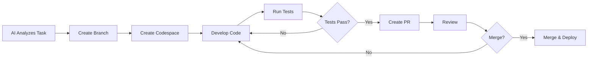

# GitHub MCP with Codespaces: Complete Guide

**Date**: 2025-01-27  
**Purpose**: Comprehensive guide to using GitHub MCP (Model Context Protocol) with GitHub Codespaces for enhanced AI-powered development workflows

---

## What is GitHub MCP?

**GitHub MCP (Model Context Protocol)** is a standardized protocol that enables AI assistants (like those in Cursor IDE) to interact directly with GitHub repositories, issues, pull requests, and other GitHub resources through a unified interface.

### Key Capabilities

GitHub MCP provides AI agents with the ability to:

1. **Repository Management**
   - Create, fork, and clone repositories
   - Manage branches and tags
   - View repository metadata and statistics

2. **Code Operations**
   - Search through code across repositories
   - Create, read, update, and delete files
   - Commit changes and manage history
   - Review code and diffs

3. **Issue & PR Management**
   - Create and update issues
   - Manage pull requests (create, review, merge)
   - Add comments and reviews
   - Apply labels, assignees, and milestones

4. **Collaboration Features**
   - Manage project boards
   - Handle discussions
   - Control access permissions
   - Track repository activity

---

## What is GitHub Codespaces?

**GitHub Codespaces** is a cloud-based development environment that runs in your browser or VS Code. It provides:

- **Instant Development Environment**: Pre-configured with your repository's dependencies
- **Cloud-Powered**: Runs on GitHub's infrastructure (no local setup needed)
- **VS Code Experience**: Full VS Code editor in the browser
- **Pre-configured**: Automatically sets up your dev environment from `.devcontainer` or repository config
- **Scalable**: Choose machine types based on your needs

---

## Why Combine GitHub MCP with Codespaces?

### 1. **Seamless AI-Powered Development**
- AI can create repositories → open in Codespaces → develop code → commit changes
- End-to-end workflow without leaving your AI assistant

### 2. **Consistent Development Environment**
- MCP can trigger Codespace creation with specific configurations
- Ensures all developers (and AI) work in identical environments

### 3. **Automated Workflow Orchestration**
- AI can manage the entire development lifecycle:
  - Create feature branch → Open Codespace → Develop → Test → Create PR → Review → Merge

### 4. **Resource Efficiency**
- No need to clone repositories locally
- AI can work directly in cloud environments
- Faster iteration cycles

---

## Use Cases: GitHub MCP + Codespaces

### Use Case 1: AI-Powered Feature Development

**Scenario**: AI assistant creates a new feature from scratch

**Workflow**:
1. **MCP**: Create new branch `feature/ai-generated-component`
2. **MCP**: Create Codespace for the branch
3. **MCP**: Create new files (components, tests, docs)
4. **MCP**: Commit changes with descriptive messages
5. **MCP**: Create pull request with AI-generated description
6. **Codespaces**: Developer reviews in cloud environment
7. **MCP**: Merge PR after approval

**Example Prompt**:
```
"Create a new React component for user authentication. 
Start a new branch, open it in Codespaces, create the component 
with tests, and open a PR."
```

---

### Use Case 2: Automated Code Review & Testing

**Scenario**: AI reviews code and tests it in isolated environment

**Workflow**:
1. **MCP**: Detect new PR created
2. **MCP**: Create Codespace from PR branch
3. **MCP**: Run automated tests in Codespace
4. **MCP**: Analyze code quality and security
5. **MCP**: Post review comments with suggestions
6. **MCP**: Approve or request changes based on results

**Benefits**:
- Isolated testing environment
- No impact on local machine
- Consistent test results

---

### Use Case 3: Multi-Repository Development

**Scenario**: Working across multiple repositories simultaneously

**Workflow**:
1. **MCP**: Identify related repositories
2. **MCP**: Create Codespaces for each repository
3. **MCP**: Coordinate changes across repositories
4. **MCP**: Create linked PRs with dependencies
5. **MCP**: Manage release coordination

**Example**:
- Frontend repo (React)
- Backend repo (Node.js)
- Documentation repo
- All managed via MCP, all in Codespaces

---

### Use Case 4: Onboarding & Environment Setup

**Scenario**: New team member needs development environment

**Workflow**:
1. **MCP**: Create onboarding issue
2. **MCP**: Generate Codespace configuration
3. **MCP**: Create setup documentation
4. **MCP**: Open Codespace with pre-configured environment
5. **MCP**: Run setup scripts automatically

**Benefits**:
- Zero local setup required
- Consistent environment for all team members
- Faster onboarding

---

### Use Case 5: AI-Powered Bug Fixing

**Scenario**: AI identifies and fixes bugs automatically

**Workflow**:
1. **MCP**: Monitor issues for bug reports
2. **MCP**: Analyze code to identify root cause
3. **MCP**: Create fix branch
4. **MCP**: Open Codespace to test fix
5. **MCP**: Create fix with tests
6. **MCP**: Create PR with fix description
7. **MCP**: Link to original issue

---

## Setup Guide: GitHub MCP + Codespaces

### Step 1: Configure GitHub MCP in Cursor IDE

#### Option A: Using Smithery CLI (Recommended)

```bash
# Install GitHub MCP server
npx -y @smithery/cli@latest install @smithery-ai/github \
  --client cursor \
  --config '{
    "githubPersonalAccessToken": "your_github_token",
    "githubApiUrl": "https://api.github.com"
  }'
```

#### Option B: Manual Configuration

1. **Locate Cursor MCP Settings**:
   - **Windows**: `%APPDATA%\Cursor\User\globalStorage\saoudrizwan.claude-dev\settings\cline_mcp_settings.json`
   - **macOS**: `~/Library/Application Support/Cursor/User/globalStorage/saoudrizwan.claude-dev/settings/cline_mcp_settings.json`
   - **Linux**: `~/.config/Cursor/User/globalStorage/saoudrizwan.claude-dev/settings/cline_mcp_settings.json`

2. **Add GitHub MCP Configuration**:
```json
{
  "mcpServers": {
    "github": {
      "command": "npx",
      "args": ["-y", "@modelcontextprotocol/server-github"],
      "env": {
        "GITHUB_PERSONAL_ACCESS_TOKEN": "ghp_your_token_here",
        "GITHUB_API_URL": "https://api.github.com"
      }
    }
  }
}
```

### Step 2: Get GitHub Personal Access Token

1. Go to **GitHub Settings** → **Developer settings** → **Personal access tokens** → **Tokens (classic)**
2. Click **Generate new token (classic)**
3. Select scopes:
   - ✅ `repo` (Full control of private repositories)
   - ✅ `workflow` (Update GitHub Action workflows)
   - ✅ `codespace` (Full control of codespaces)
   - ✅ `read:org` (Read org and team membership)
   - ✅ `write:packages` (Upload packages)
   - ✅ `read:packages` (Download packages)
4. Copy the token and add to MCP configuration

### Step 3: Configure Codespaces

#### Create `.devcontainer` Configuration

Create `.devcontainer/devcontainer.json` in your repository:

```json
{
  "name": "AI Development Environment",
  "image": "mcr.microsoft.com/devcontainers/javascript-node:18",
  
  "features": {
    "ghcr.io/devcontainers/features/github-cli:1": {
      "version": "latest"
    },
    "ghcr.io/devcontainers/features/docker-in-docker:2": {
      "version": "latest"
    }
  },
  
  "customizations": {
    "vscode": {
      "extensions": [
        "dbaeumer.vscode-eslint",
        "esbenp.prettier-vscode",
        "github.copilot",
        "github.copilot-chat"
      ],
      "settings": {
        "editor.formatOnSave": true,
        "editor.defaultFormatter": "esbenp.prettier-vscode"
      }
    }
  },
  
  "postCreateCommand": "npm install && npm run build",
  
  "remoteUser": "node",
  
  "forwardPorts": [3000, 8080],
  
  "portsAttributes": {
    "3000": {
      "label": "Application",
      "onAutoForward": "notify"
    }
  }
}
```

#### Create Codespace Configuration File

Create `.github/codespaces/codespaces-config.yml`:

```yaml
# Codespace configuration for AI-powered development
onCreateCommand: |
  echo "Setting up AI development environment..."
  npm install
  npm run setup

postCreateCommand: |
  echo "Environment ready for AI development"
  git config --global user.name "AI Assistant"
  git config --global user.email "ai@example.com"

customizations:
  vscode:
    settings:
      "editor.inlineSuggest.enabled": true
      "github.copilot.enable": {
        "*": true
      }
```

---

## Practical Examples

### Example 1: AI Creates Feature in Codespace

**User Prompt**:
```
"Create a new authentication feature. Create a branch, 
open it in Codespaces, build the feature with tests, 
and prepare a PR."
```

**AI Workflow** (via GitHub MCP):
1. Create branch: `feature/user-authentication`
2. Create Codespace from branch
3. Create files:
   - `src/auth/AuthComponent.tsx`
   - `src/auth/AuthComponent.test.tsx`
   - `docs/auth-feature.md`
4. Commit changes
5. Create PR with description

**MCP Commands Used**:
```javascript
// Create branch
mcp_github_create_branch({
  owner: "your-org",
  repo: "your-repo",
  branch: "feature/user-authentication",
  from_branch: "main"
})

// Create Codespace (via GitHub API)
// Note: Codespace creation requires GitHub API, not MCP directly
// But MCP can trigger it via API calls

// Create files
mcp_github_create_or_update_file({
  owner: "your-org",
  repo: "your-repo",
  path: "src/auth/AuthComponent.tsx",
  content: "...",
  message: "Add authentication component",
  branch: "feature/user-authentication"
})

// Create PR
mcp_github_create_pull_request({
  owner: "your-org",
  repo: "your-repo",
  title: "Add user authentication feature",
  head: "feature/user-authentication",
  base: "main",
  body: "AI-generated authentication feature with tests"
})
```

---

### Example 2: Automated Code Review

**Workflow**:
```javascript
// AI reviews PR automatically
const reviewPR = async (prNumber) => {
  // Get PR files
  const files = await mcp_github_get_pull_request_files({
    owner: "your-org",
    repo: "your-repo",
    pull_number: prNumber
  })
  
  // Create Codespace for testing
  // (via GitHub API)
  
  // Run tests in Codespace
  // Analyze code quality
  
  // Post review
  await mcp_github_create_pull_request_review({
    owner: "your-org",
    repo: "your-repo",
    pull_number: prNumber,
    body: "AI Code Review Results",
    event: "COMMENT",
    comments: [
      {
        path: "src/component.tsx",
        line: 42,
        body: "Consider using useMemo here for performance"
      }
    ]
  })
}
```

---

### Example 3: Multi-Repository Coordination

**Scenario**: Update shared component across multiple repos

```javascript
const updateSharedComponent = async () => {
  const repos = [
    { owner: "org", repo: "frontend-app" },
    { owner: "org", repo: "admin-dashboard" },
    { owner: "org", repo: "mobile-app" }
  ]
  
  for (const { owner, repo } of repos) {
    // Create branch
    await mcp_github_create_branch({
      owner,
      repo,
      branch: "update-shared-component",
      from_branch: "main"
    })
    
    // Create Codespace
    // Update component
    await mcp_github_create_or_update_file({
      owner,
      repo,
      path: "src/shared/Component.tsx",
      content: updatedComponent,
      message: "Update shared component",
      branch: "update-shared-component"
    })
    
    // Create PR
    await mcp_github_create_pull_request({
      owner,
      repo,
      title: "Update shared component",
      head: "update-shared-component",
      base: "main"
    })
  }
}
```

---

## Best Practices

### 1. **Codespace Configuration Management**

✅ **Do**:
- Use `.devcontainer` for consistent environments
- Version control your Codespace configurations
- Use environment-specific configurations

❌ **Don't**:
- Hardcode secrets in configurations
- Create Codespaces without cleanup policies
- Ignore resource limits

### 2. **MCP Token Security**

✅ **Do**:
- Use fine-grained tokens with minimal permissions
- Rotate tokens regularly
- Store tokens securely (environment variables, secrets manager)

❌ **Don't**:
- Commit tokens to repositories
- Share tokens across team members
- Use tokens with excessive permissions

### 3. **Workflow Optimization**

✅ **Do**:
- Batch related operations
- Use Codespaces for isolated testing
- Automate cleanup of unused Codespaces

❌ **Don't**:
- Create Codespaces for every small change
- Leave Codespaces running unnecessarily
- Ignore cost implications

### 4. **Error Handling**

✅ **Do**:
- Implement retry logic for API calls
- Handle rate limiting gracefully
- Log errors for debugging

❌ **Don't**:
- Ignore API errors
- Make excessive API calls
- Fail silently

---

## Advanced Patterns

### Pattern 1: AI Development Loop



### Pattern 2: Multi-Stage Development

1. **Planning Stage**: AI creates issues and plans
2. **Development Stage**: AI creates Codespaces and develops
3. **Testing Stage**: AI runs tests in isolated Codespaces
4. **Review Stage**: AI reviews and suggests improvements
5. **Deployment Stage**: AI manages deployment

---

## Cost Considerations

### Codespace Pricing

- **Free Tier**: 60 hours/month for personal accounts
- **Paid Plans**: 
  - 2-core: ~$0.18/hour
  - 4-core: ~$0.36/hour
  - 8-core: ~$0.72/hour

### Optimization Tips

1. **Auto-stop**: Configure Codespaces to stop after inactivity
2. **Right-sizing**: Use appropriate machine types
3. **Cleanup**: Delete unused Codespaces regularly
4. **Scheduling**: Use Codespaces only when needed

---

## Troubleshooting

### Issue: MCP Can't Create Codespaces

**Solution**: 
- Ensure token has `codespace` scope
- Check GitHub API rate limits
- Verify repository permissions

### Issue: Codespace Creation Fails

**Solution**:
- Check `.devcontainer` configuration
- Verify repository has Codespaces enabled
- Check billing/usage limits

### Issue: MCP Commands Timeout

**Solution**:
- Increase timeout settings
- Check network connectivity
- Verify API token is valid

---

## Resources

### Official Documentation
- **GitHub MCP**: https://github.com/modelcontextprotocol/servers/tree/main/src/github
- **GitHub Codespaces**: https://docs.github.com/en/codespaces
- **MCP Specification**: https://modelcontextprotocol.io

### Related Tools
- **Smithery**: https://smithery.dev (MCP server registry)
- **Cursor IDE**: https://cursor.sh (AI-powered IDE)
- **GitHub CLI**: https://cli.github.com

---

## Next Steps

1. **Set Up GitHub MCP**: Follow Step 1 in Setup Guide
2. **Configure Codespaces**: Create `.devcontainer` configuration
3. **Test Integration**: Try creating a branch and Codespace via MCP
4. **Automate Workflows**: Build custom workflows combining MCP and Codespaces
5. **Monitor Usage**: Track Codespace usage and optimize costs

---

**Last Updated**: 2025-01-27

